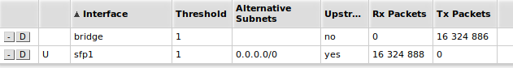
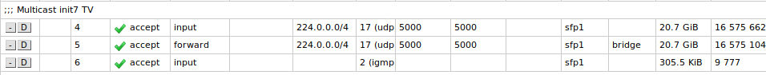
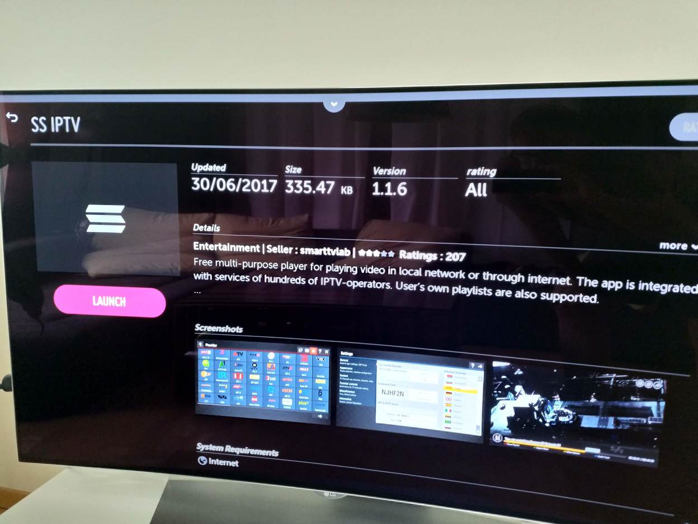
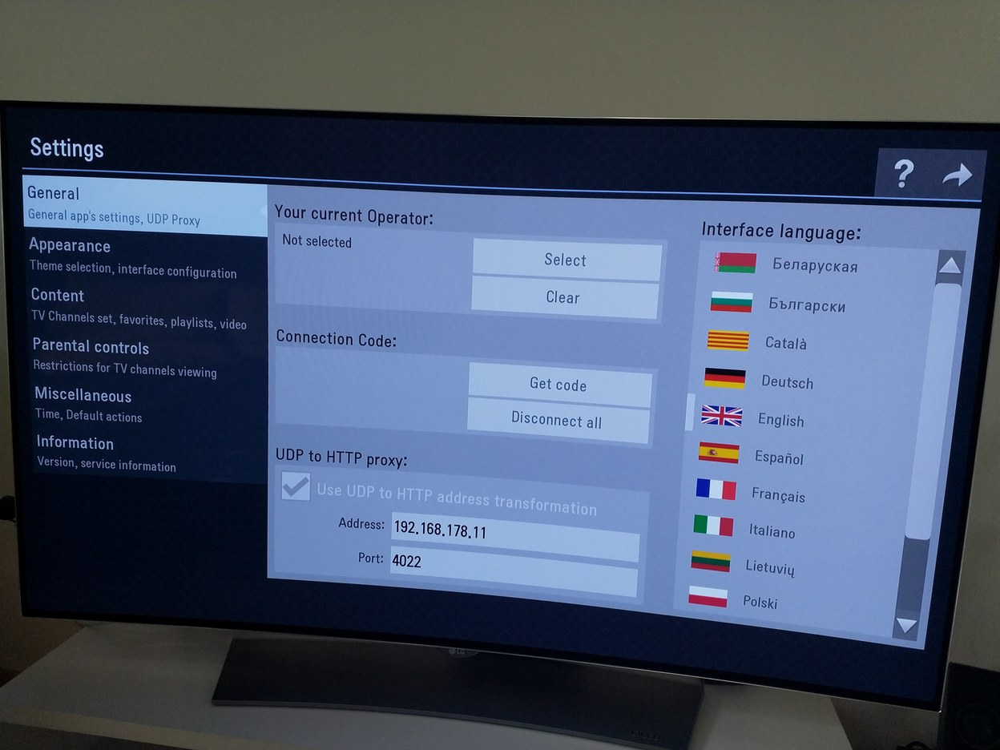
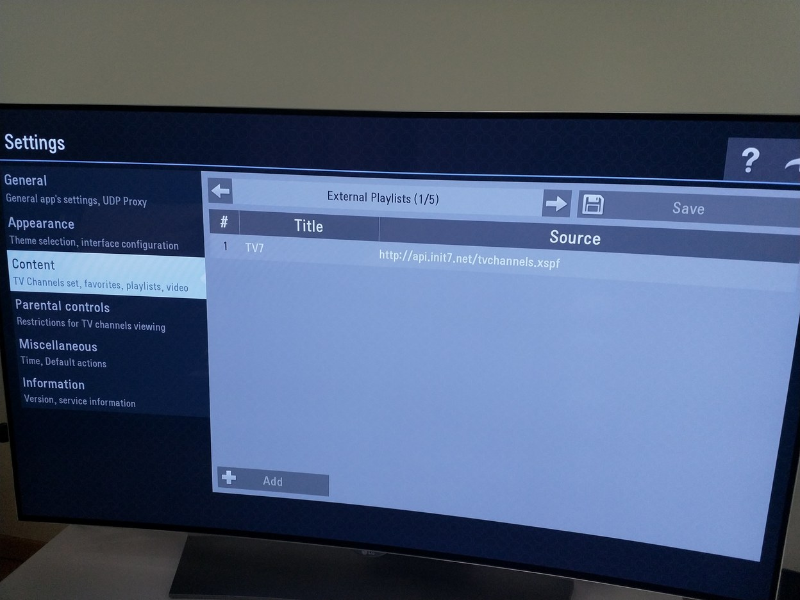
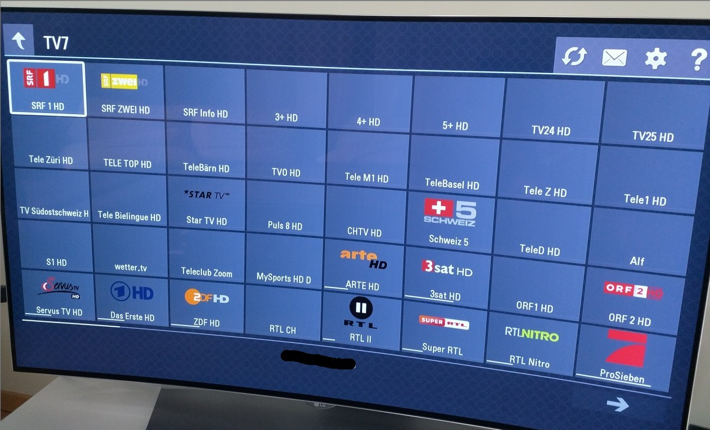
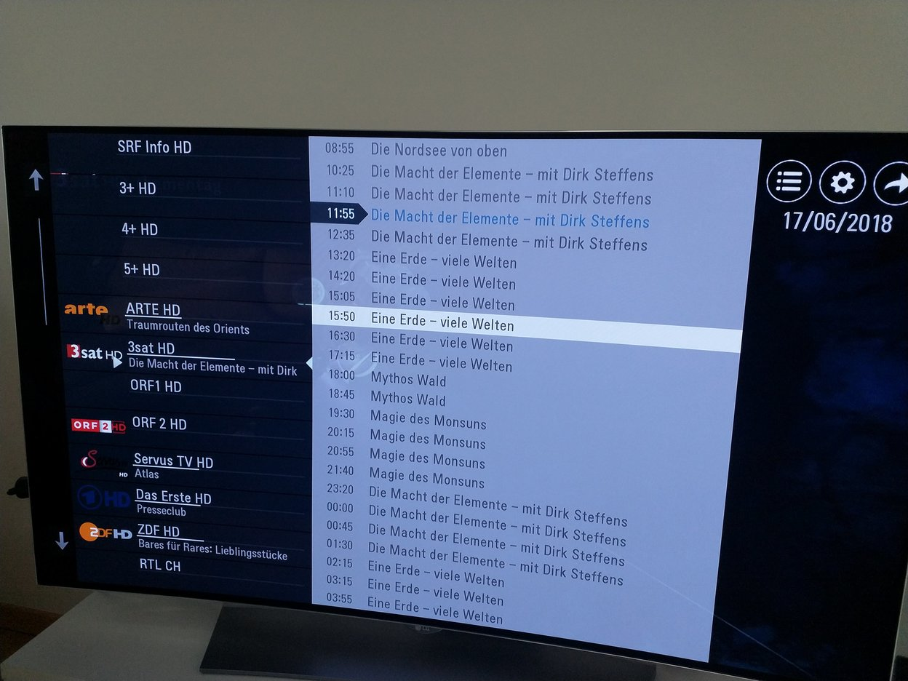

# init7.net - Multicast IPTV

Init7 launched a free IPTV service for their customers (https://www.init7.net/en/tv/offer/) based on multicast. I am extremely impressed by the quality of that service!

Multicast has a few limitation and I choose to use [udpxy](http://www.udpxy.com/) to bridge the IPTV streams to devices on my LAN.

This guide show how I implement it.

**My setup:**

* TV - LG 55EG920V - WebOS
* Android mobile phone
* Raspberry Pi 1
* Router: MikroTik hex S

**Limitations:**

* Raspberry PI 1 is not that powerful and can only serve one client at the same time
* Haven't figured out how to get the LG TV to autostart SS IPTV

**The cool stuff:**

* Zapping on TV is working properly
* No dependency to Cablecom
* No delayed TV signal
* Lot's of HD channels


## Design

```
==================================================================================================
  Init7 network
   (public network)    +------------------+    +----------------------------------------+
                       |  Multicast IPTV  |    |               Init7 Playlist           |
                       |    224.0.0.0/4   |    |  http://api.init7.net/tvchannels.xspf  |
                       +--------|---------+    +---------------------|------------------+
                                |                                    |
                                +-------------------------+----------+
                                                          |
                                            +-------------|------------+
                                            |      Mikrotik hex S      |
============================================|      192.168.178.1       |==========================
  LAN                                       |        igmpproxy         |
                                            +---|---|------------------+
                                                |   |
                   +----------------------------+   |
                   |                                |
         +---------|-------+        +---------------|----+          +----------------------+
         |  Raspberry PI   |        |  Orbi Wifi Router  | <-MESH-> |  Orbi Wifi Satelite  |
         | 192.168.178.11  |        |                    |          |                      |
         |       udpxy     |        |                    |          |                      |
         +-----------------+        +-----------*--------+          +----*-----------------+
                                              *  *                     *
                                            *     *  ((( Wireless ))) *
                                          *                  *           *
                                +-------*---+       +--------*-----+     +-*--------+
                                |   LG TV   |       |    Android   |     |  Laptop  |
                                |  SS IPTV  |       |  IPTV / VLC  |     |    VLC   |
                                +-----------+       +--------------+     +----------+
  WLAN
==================================================================================================
```


## Preparation

### Mikrotik hex S

We need to do two things on the router:

1. Install and configure multicast
2. Grant firewall access for multicast and igmp traffic

Assumption:

* Router is accessible on http://192.168.178.1
* Firmware is version 6.42.3 (please make sure you are updated)

#### Install and configure multicast / igmp

1. Go to the mikrotik download page (http://www.mikrotik.com/download) and get the "Extra Packages" for your router (Mikrotik hex S = mmips)

2. Unzip the all `all_packages-mmips-6.42.3.zip`

3. Upload the `multicast-6.42.3-mmips.npk` to the root directory of the router using `http://192.168.178.1/webfig/#Files`

4. Reboot the router to install

5. Open http://192.168.178.1/webfig/#Routing:IGMP_Proxy and add two new interfaces

   1. Public interface (in my case sfp1) and mark it "upstream"

   2. Internal interface (in my case bridge)

      

#### Grant firewall access for multicast and igmp traffic

1. Open http://192.168.178.1/webfig/#IP:Firewall and add three rules above the drop all not from LAN rule

   1. Allow UDP traffic from and to port 5000 incoming WAN

   2. Allow UDP traffic from and to port 5000 forwarded from WAN to LAN

   3. Allow igmp traffic incoming on WAN

      


With this configuration it is already possible for wired connected LAN devices to read the multicast IPTV traffic. 

### Raspberry Pi - udpxy

It is a challenge to read multicast streams with wireless devices. I am using an old Raspberry Pi 1 to act as a proxy to transform UDP-to-HTTP traffic using [udpxy](http://www.udpxy.com/).

1. Prepare a SD card with [Raspbian](https://www.raspberrypi.org/downloads/raspbian/)

2. Connect the Raspberry Pi directly to the Mikrotik (shortest physical distance). I had issues connecting the raspberry to the Orbi.

3. Boot the raspberry and configure a fixed IP (192.168.178.11)

4. Become root and download udpxy in /root -> http://www.udpxy.com/download/udpxy/udpxy-src.tar.gz

5. Unpack `udpxy-src.tar.gz` and cd into the new directory

6. Run make, which generates the udpxy executable

7. Add a new systemd service file as `/etc/systemd/system/udpxy.service`

   Check the version. I was lazy.. ;)

   ```
   [Unit]
   Description=udpxy
   Wants=basic.target
   After=basic.target network.target

   [Service]
   ExecStart=/root/udpxy-1.0.23-12/udpxy -p 4022 -T -s -n -20
   ExecReload=/bin/kill -HUP $MAINPID
   KillMode=process
   Restart=always
   RestartSec=18s
   User=root

   [Install]
   WantedBy=multi-user.target
   ```

8. run `systemctl enable udpxy.service` and `systemctl start udpxy.service`

Now we have a proxy running on LAN to provide a UDP-to-HTTP bridge

### LG TV

LG WebOS seems not to support native IPTV. But there is ***SS IPTV*** available on the LG content store.

1. Install SS IPTV from the LG Content store

   

2. Launch SS IPTV and configure the upstream proxy location

   

3. Add init7 channel list

   

4. Enjoy TV

   

   

### Android

Android configuration is similar to the LG. The App I use here is [IPTV](https://play.google.com/store/apps/details?id=ru.iptvremote.android.iptv) together with VLC.

Configure Proxy and Playlist like on LG TV and enjoy TV.


